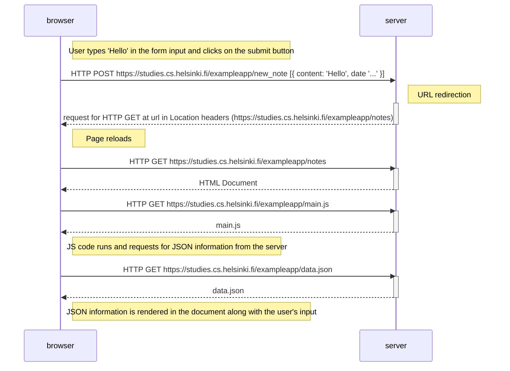

```mermaid
sequenceDiagram
  participant browser
  participant server

  Note right of browser: User types 'Hello' in the form input and clicks on the submit button

  browser ->> server: HTTP POST https://studies.cs.helsinki.fi/exampleapp/new_note [{ content: 'Hello', date '...' }]

  Note right of server: URL redirection

  activate server
  server -->> browser: request for HTTP GET at url in Location headers (https://studies.cs.helsinki.fi/exampleapp/notes)
  deactivate server

  Note right of browser: Page reloads

  browser ->> server: HTTP GET https://studies.cs.helsinki.fi/exampleapp/notes

  activate server
  server -->> browser: HTML Document
  deactivate server

  browser ->> server: HTTP GET https://studies.cs.helsinki.fi/exampleapp/main.js

  activate server
  server -->> browser: main.js
  deactivate server

  Note right of browser: JS code runs and requests for JSON information from the server

  browser ->> server: HTTP GET https://studies.cs.helsinki.fi/exampleapp/data.json

  activate server
  server -->> browser: data.json
  deactivate server

  Note right of browser: JSON information is rendered in the document along with the user's input 
```
