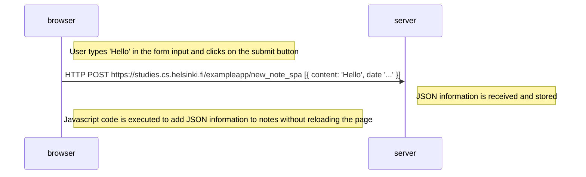

```mermaid
sequenceDiagram
  participant browser
  participant server

  Note right of browser: User types 'Hello' in the form input and clicks on the submit button

  browser ->> server: HTTP POST https://studies.cs.helsinki.fi/exampleapp/new_note_spa [{ content: 'Hello', date '...' }]
  
  Note right of server: JSON information is received and stored

  Note right of browser: Javascript code is executed to add JSON information to notes without reloading the page 
```
